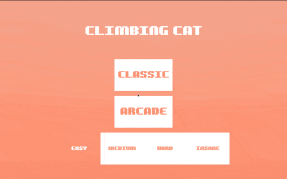
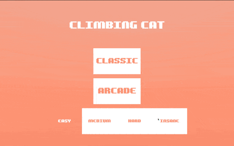

[🕹️ Can be played here 🕹️](https://lombardidelavega.itch.io/climbingcat)

# Context
Project created as part of a job interview and completed in the equivalent of one day of work spread over less than a week.  
Originally designed for mobile devices, the game is optimized for vertical screen format.  
Some TODOs remain in the codebase and I made some pragmatic shortcuts to respect the time constraints. However, I believe the overall project structure and code quality remain solid despite these compromises.  
The code architecture allowed for super quick implementation of additional features like multiple difficulty levels and an arcade mode, demonstrating its flexibility and maintainability.  
Overall, although it could definitely be refined, I'm satisfied with the time invested/results achieved ratio.

# Summary
It's an arcade game where you control a cat climbing a tower.  
Your goal is to reach the top as quickly as possible by pressing the correct colored buttons.  
Each wrong button press will penalize you with a time penalty, making the climb more challenging.  
The game features different difficulty levels and game modes to test your reflexes and pattern recognition skills.

